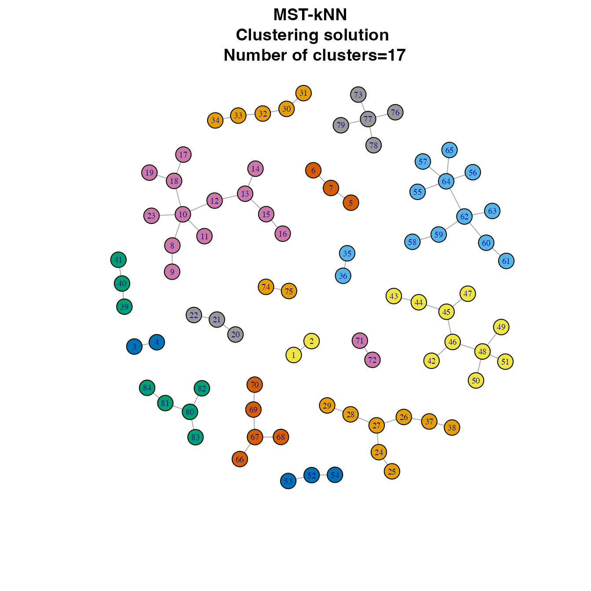

# A quick guide of mstknnclust package

## Introduction

Clustering is a common data mining task commonly used to reveal
structures hidden in large data sets. The clustering problem consists of
finding groups of objects, such that objects that are in the same group
are similar and objects in different groups are dissimilar. Clustering
algorithms can be classified according to different parameters. One
particular type of algorithms that can be distinguished is the
**graph-based clustering**. In the graph-based clustering algorithms,
the data set can be modeled as a graph. In such a graph, a *node*
represents an object of the data set, an *edge* a link between pairs of
nodes. Each edge has a *costs* that corresponds to the distance between
two nodes, calculated using a chosen distance measure.

One of the clustering algorithms within the *graph-based* approach is
the **MST-kNN** (Inostroza-Ponta 2008). It uses two proximity graphs:
*minimum spanning tree (MST)* and *k nearest neighbor (kNN)*. They can
model the data and highlight the more important relationships between
the objects of the data. MST-kNN requires minimal user intervention due
to the automatic selection of the number of clusters. Such a situation
is adequate in scenarios where the structure of the data is unknown.

This document gives a quick guide of the `mstknnclust` package (version
0.3.1). It corresponds to the implementation of the MST-kNN clustering
algorithm. For further details to see
[`help(package="mstknnclust")`](https://rdrr.io/pkg/mstknnclust/man). If
you use this R package do not forget to include the references provided
by `citation("mstknnclust")`.

## How does MST-kNN clustering works?

The MST-kNN clustering algorithm is based on the *intersection* of the
edges of two proximity graphs: **MST** and **kNN**. The *intersection*
operation conserves only those edges between two nodes that are
reciprocal in both proximity graphs. After the first application of the
algorithm, a graph with one or more connected components (*cc*) is
generated. MST-kNN algorithm is recursively applied in each component
until the number of *cc* obtained is one.

The algorithm requires a **distance matrix** *d* as input containing the
distance between *n* objects. Then, the next steps are performed:

1.  Computes a **complete graph (CG)** that represents the data, with
    one *node* per object, one *edge* for each pair of objects, and the
    *cost* of the edge equal to the distance between the objects
    obtained from distance matrix *d*.
2.  Computes the **MST** graph through Prim’s algorithm (Prim 1957) and
    using the **complete graph** as input.
3.  Computes the **kNN** graph using the **complete graph** as input and
    determining the value of *k* according to:

``` math
\begin{equation}
k= \min \bigg\{ \lfloor \ln(n)\rfloor ; \min k \mid \text{kNN graph is connected} \bigg\}
\end{equation}
```

4.  Performs the **intersection** of the edges of the MST and kNN
    graphs. It will produce a graph with $`cc\geq1`$ connected
    components
5.  Evaluates the numbers of connected components (cc) in the graph
    produced. If $`cc=1`$ the algorithm stops. If $`cc>1`$, the steps
    1-4 are recursively applied in each of the connected components of
    the graph.
6.  Finally, when the algorithm stops in step 5 in any recursion, it
    performs the **union** of the graphs produced by the application of
    the MST-kNN algorithm in each recursion.

## Installation instructions

The **mstknnclust** package requires **igraph** package to work and to
visualize some graphs as networks. This package is included as a
mandatory dependency, so users who install the mstknnclust package will
have them automatically. To install the `mstknnclust` package use
`install.packages("mstknnclust")`.

## Example on Indo-European languages data set

### Load package

``` r
#loads package
library("mstknnclust")
```

### Load example data

``` r
#loads dataset
data(dslanguages)
```

|            |   IrishA |   IrishB |   WelshN |   WelshC | BretonList | BretonSE |
|:-----------|---------:|---------:|---------:|---------:|-----------:|---------:|
| IrishA     | 0.000000 | 0.001211 | 0.002907 | 0.002924 |   0.003215 | 0.003236 |
| IrishB     | 0.001211 | 0.000000 | 0.002817 | 0.002778 |   0.002985 | 0.003115 |
| WelshN     | 0.002907 | 0.002817 | 0.000000 | 0.001065 |   0.001565 | 0.001590 |
| WelshC     | 0.002924 | 0.002778 | 0.001065 | 0.000000 |   0.001626 | 0.001639 |
| BretonList | 0.003215 | 0.002985 | 0.001565 | 0.001626 |   0.000000 | 0.001126 |
| BretonSE   | 0.003236 | 0.003115 | 0.001590 | 0.001639 |   0.001126 | 0.000000 |

Distance between first six objects to group

### Performing MST-kNN clustering algorithm

``` r
#Performs MST-kNN clustering using languagesds distance matrix
results <- mst.knn(dslanguages)
```

#### Getting the results

The function `mst.knn` returns a list with the elements:

1.  **cnumber**: A numeric value representing the number of clusters of
    the solution.
2.  **cluster**: A named vector of integers from *1:cnumber*
    representing the cluster to which each object is assigned.
3.  **partition**: A partition matrix order by cluster where are shown
    the objects and the cluster where they are assigned.
4.  **csize**: A vector with the cardinality of each cluster in the
    solution.
5.  **network**: An object of class “igraph” as a network representing
    the clustering solution.

&nbsp;

    ## Number of clusters:

    ## Objects by cluster:  8 11 5 2 2 3 13 3 5 2 3 10 3 5 2 5 2

    ## Named vector of cluster allocation:

    ##        IrishA        IrishB        WelshN        WelshC    BretonList 
    ##             4             4             5             5             6 
    ##      BretonSE      BretonST  RumanianList         Vlach       Italian 
    ##             6             6             7             7             7 
    ##         Ladin     Provencal        French       Walloon FrenchCreoleC 
    ##             7             7             7             7             7 
    ## FrenchCreoleD    SardinianN    SardinianL    SardinianC       Spanish 
    ##             7             7             7             7             8 
    ##  PortugueseST     Brazilian       Catalan      GermanST     PennDutch 
    ##             8             8             7             1             1 
    ##     DutchList     Afrikaans       Flemish       Frisian     SwedishUp 
    ##             1             1             1             1             9 
    ##     SwedishVL   SwedishList        Danish       Riksmal   IcelandicST 
    ##             9             9             9             9            10 
    ##       Faroese     EnglishST      Takitaki   LithuanianO  LithuanianST 
    ##            10             1             1            11            11 
    ##       Latvian     Slovenian     LusatianL     LusatianU         Czech 
    ##            11            12            12            12            12 
    ##        Slovak        CzechE     Ukrainian  Byelorussian        Polish 
    ##            12            12            12            12            12 
    ##       Russian    Macedonian     Bulgarian Serbocroatian       GypsyGk 
    ##            12            13            13            13             2 
    ##    Singhalese      Kashmiri       Marathi      Gujarati     PanjabiST 
    ##             2             2             2             2             2 
    ##        Lahnda         Hindi       Bengali    NepaliList      Khaskura 
    ##             2             2             2             2             2 
    ##       GreekML       GreekMD      GreekMod        GreekD        GreekK 
    ##            14            14            14            14            14 
    ##   ArmenianMod  ArmenianList       Ossetic        Afghan        Waziri 
    ##            15            15            16            17            17 
    ##   PersianList        Tadzik       Baluchi         Wakhi     AlbanianT 
    ##            16            16            16            16             3 
    ##   AlbanianTop     AlbanianG     AlbanianK     AlbanianC 
    ##             3             3             3             3

    ## Data matrix partition (partial):

| object       | cluster |
|:-------------|--------:|
| GreekK       |      14 |
| ArmenianMod  |      15 |
| ArmenianList |      15 |
| Ossetic      |      16 |
| PersianList  |      16 |
| Tadzik       |      16 |
| Baluchi      |      16 |
| Wakhi        |      16 |
| Afghan       |      17 |
| Waziri       |      17 |

#### Visualizing clustering

The clustering solutions can be shown as a network where clusters are
identified by colors. To perform the visualization we need the R package
**igraph** (Csardi and Nepusz 2006).

``` r
library("igraph")
```

    ## 
    ## Attaching package: 'igraph'

    ## The following objects are masked from 'package:stats':
    ## 
    ##     decompose, spectrum

    ## The following object is masked from 'package:base':
    ## 
    ##     union

``` r
igraph::V(results$network)$label.cex <- seq(0.6,0.6,length.out=vcount(results$network))

plot(results$network, vertex.size=8, 
     vertex.color=igraph::clusters(results$network)$membership, 
     layout=igraph::layout.fruchterman.reingold(results$network, niter=10000),
     main=paste("MST-kNN \n Clustering solution \n Number of clusters=",results$cnumber,sep="" ))
```

    ## Warning: `clusters()` was deprecated in igraph 2.0.0.
    ## ℹ Please use `components()` instead.
    ## This warning is displayed once per session.
    ## Call `lifecycle::last_lifecycle_warnings()` to see where this warning was
    ## generated.

    ## Warning: `layout.fruchterman.reingold()` was deprecated in igraph 2.1.0.
    ## ℹ Please use `layout_with_fr()` instead.
    ## This warning is displayed once per session.
    ## Call `lifecycle::last_lifecycle_warnings()` to see where this warning was
    ## generated.



## References

Csardi, Gabor, and Tamas Nepusz. 2006. “The Igraph Software Package for
Complex Network Research.” *InterJournal* Complex Systems: 1695.
<https://igraph.org>.

Inostroza-Ponta, Mario. 2008. “An Integrated and Scalable Approach Based
on Combinatorial Optimization Techniques for the Analysis of Microarray
Data.” PhD thesis, School of Electrical Engineering; Computer Science.
University of Newcastle.

Prim, R. C. 1957. “Shortest Connection Networks and Some
Generalizations.” *The Bell System Technical Journal* 36 (6): 1389–1401.
